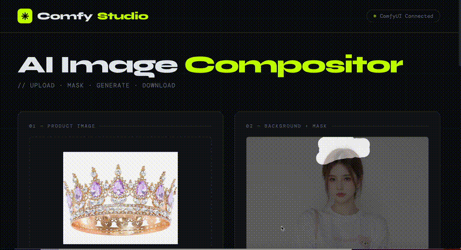
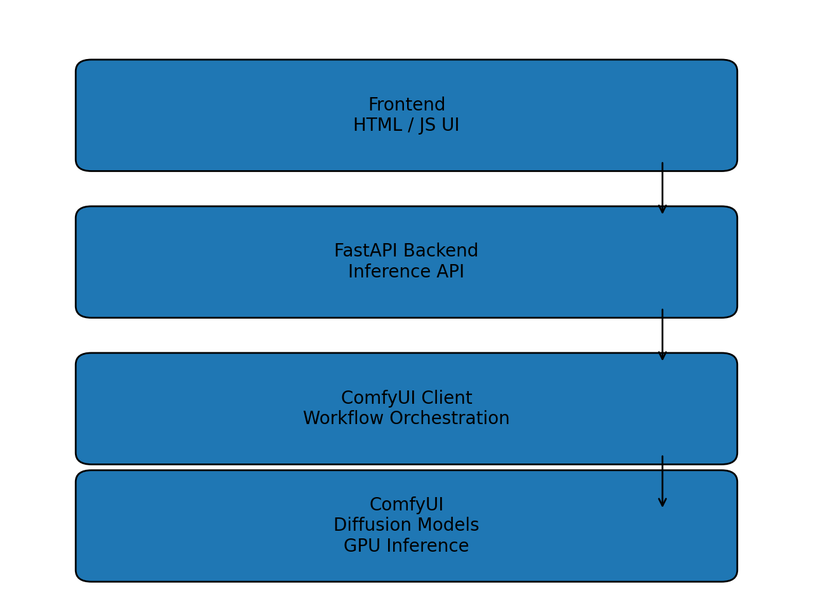

# AI Virtual Try-On System






Production-ready AI virtual try-on system using ComfyUI, FastAPI, and diffusion models.

## Architecture

Frontend → FastAPI Backend → ComfyUI Client → ComfyUI GPU Inference

## Features

- Diffusion model virtual try-on
- FastAPI inference backend
- ComfyUI workflow integration
- GPU accelerated inference
- Interactive frontend with mask editing

## Installation

```bash
git clone https://github.com/YOUR_USERNAME/comfyui-virtual-tryon-system
cd comfyui-virtual-tryon-system

python -m venv .venv
source .venv/bin/activate

pip install -r requirements.txt

cd backend
uvicorn app:app --host 0.0.0.0 --port 8000
```

Open browser:

http://127.0.0.1:8000

## Tech Stack

Python, FastAPI, ComfyUI, Stable Diffusion, HTML, JavaScript

## Author

Shangyu Chen
